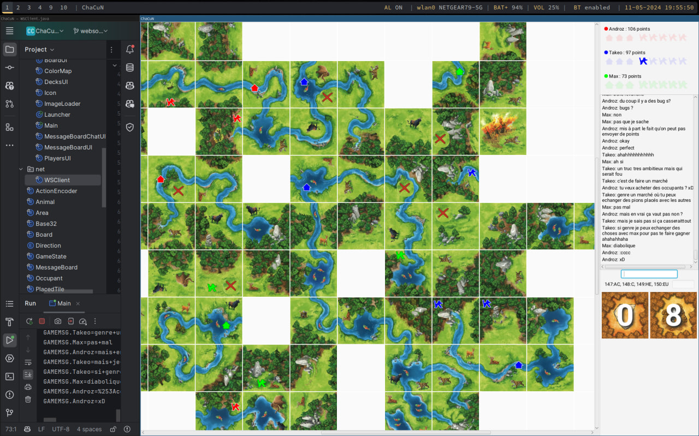

# ChaCuN serveur pour multijoueur (CS-108)

Un serveur pour la version électronique du jeu Chasseurs et cueilleurs au Néolithique, abrégé ChaCuN, pour le cours CS-108 à l'EPFL.

Ce jeu se joue normalement sur le même ordinateur et il est possible de faire une version permettant de fonctionner avec deux ordinateurs connectés au même réseau local.

Cependant, cela ne donne clairement pas une expérience de jeu satisfaisante surtout pour faire quelques parties pendant les vacances d'été pour fêter la fin de la première année :)

Avec l'accord de M. Schinz, nous mettons sur ce dépôt GitHub la documentation complète d'un serveur de jeu hébergé dans un datacenter et que vous pouvez utiliser dans votre propre jeu.

Ce serveur permet, entre autre :
* de rejoindre une partie (existante ou une nouvelle)
* de synchroniser une liste des joueurs
* d'envoyer des messages de chat
* d'exécuter des actions

Un anti-cheat vérifie que le joueur courant a bien les permissions de jouer, même si un utilisateur essaye d'envoyer des paquets modifiés malveillants.

Un exemple de rendu du jeu :

## Qui devrait utiliser ce dépôt ?

Il est assez difficile de créer un serveur Websocket en Java sans librairie externe, et il faut avoir un serveur pour le faire tourner. C'est assez pénible de s'embêter avec ces détails semaine 12 de l'EPFL :)

Si vous n'avez pas envie de perdre beaucoup de temps avec le projet mais souhaitez implémenter une version multijoueur, utiliser cette API ne ne sera pas considéré comme du plagiat par M. Schinz, mais aucun point lors du bonus n'est garanti. Faites-le pour le challenge et pour le plaisir d'avoir un jeu qui marche !

Le serveur sera open-sourcé quelques jours après la fin des cours.

## Serveur Discord

Pour toute question ou problème, n'hésitez pas à rejoindre le serveur Discord : https://discord.gg/QPHmesEzKe.

## Documentation

Les messages à envoyer au serveur sont représentés par un emoji ⬆️ et les messages envoyés par le serveur par un emoji ⬇️.

### Rejoindre une partie

Il est possible de rejoindre une partie en se connectant au serveur via cet endpoint:
`wss://cs108-chacun-ws-server.sys.polysource.ch?username=USERNAME&gameId=GAMEID`.

Une fois connecté, vous recevrez un message du serveur vous indiquant si vous avez bien rejoint la partie, suivi des pseudos des autres joueurs triés dans l'ordre d'arrivée (le vôtre sera donc à la fin).

⬇️ `GAMEJOIN_ACCEPT.Username1,Username2,Username3`

### Rester connecté

Pour rester connecté, vous devez répondre à chaque message de ⬇️ `PING` du serveur en renvoyant ⬆️ `PONG`.

### Envoi et réception des actions

Lorsqu'un joueur effectue une action, vous devez envoyer ⬆️ `GAMEACTION.code` où `code` représente l'action encodée en base 32 selon les spécifications de l'énoncé.

Notez que le serveur vérifie que le joueur qui envoie une action a bien l'autorisation de le faire (dans le sens où c'est bien son tour).

Le serveur envoie ensuite un message ⬇️ `GAMEACTION.code` à tous les joueurs sauf celui qui a envoyé l'action, ou ⬇️ `GAMEACTION_DENY` si l'action est invalidée par le serveur.

### Envoi et réception des messages

Lorsqu'un joueur souhaite envoyer un message, vous devez envoyer ⬆️ `GAMEMSG.content` où `content` est le contenu sérialisé du message.

Vous et les autres joueurs recevez en réponse ⬇️ `GAMEMSG.username=content` où `username=content` est le message sérialisé.
